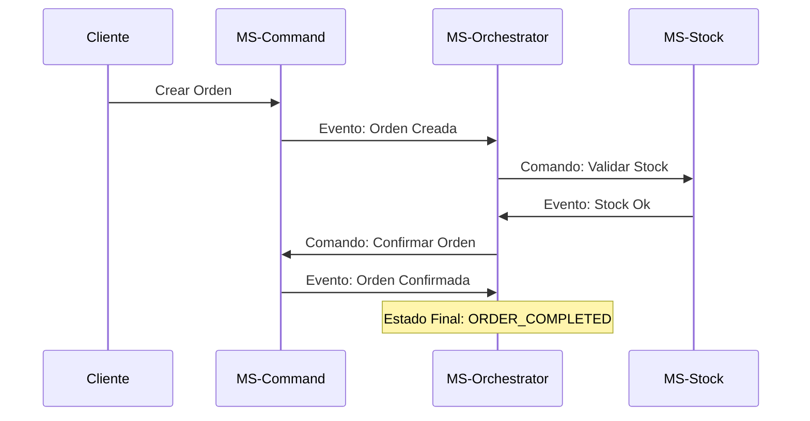
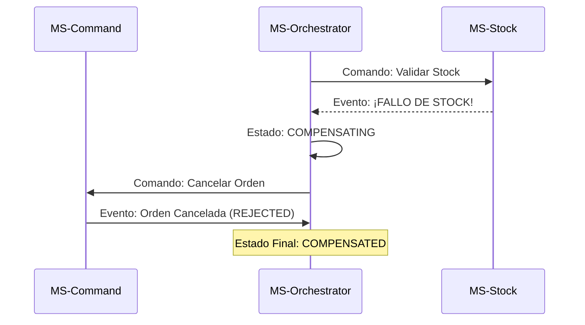

# 🎓 Proyecto Final: Arquitectura de Microservicios EDA - Logística

Este proyecto demuestra una arquitectura de microservicios robusta utilizando **Coreografía de Sagas** para transacciones distribuidas y **CQRS** (Command Query Responsibility Segregation) para optimización de lectura.

# 🎓 Proyecto Final: Levantar aplicación

Si necesitas levantar el servicio puedes hacerlo ejecutando el docker-compose.yml, adicional a eso necesitaras crear un .env con los siguientes valores para el envio de correos:

GMAIL_USERNAME=xxx@gmail.com
GMAIL_APP_PASSWORD=12345xx
NOTIFICATION_RECIPIENT_EMAIL=xxx@gmail.com

para probar el caso de error o compensatorio, necesitas cambiar el valor de 
// Simulating stock logic (always success for now, or random failure)
boolean stockAvailable = true;
de la linea 21 de ms-logistics-stock\src\main\java\pe\edu\galaxy\logistics\stock\listener\StockCommandListener.java

y ejecutar:
docker-compose up -d --build stock-mock 

## 🏗️ Arquitectura General

El sistema está compuesto por 4 microservicios principales:
- **Orquestador**: El cerebro que gestiona la máquina de estados.
- **Command**: Encargado de la persistencia de órdenes (Escritura).
- **Query**: Especializado en consultas rápidas con MongoDB y Redis (Lectura).
- **Stock**: Simulador de inventario reactivo.

---

## 🧭 Flujos de la Saga

### 1. Flujo Feliz (Happy Path)
Es el camino donde todo sale según lo planeado: la orden se crea, hay stock disponible y se confirma finalmente.

### 2. Flujo de Error (Compensación)
Ocurre cuando el stock falla. El sistema debe "deshacer" la creación de la orden para mantener la consistencia.

---

## 📊 Matriz de Estados: Negocio vs Saga

Es fundamental entender la diferencia entre lo que ve el usuario (Negocio) y cómo trabaja la maquinaria (Saga):

| Momento del Flujo | Estado en Negocio (Usuario) | Estado en Saga (Orquestador) | Notificación al Usuario |
| :--- | :--- | :--- | :--- |
| Registro Inicial | **PENDING** | `STARTED` | "Pedido recibido" |
| Validación Stock | **PENDING** | `STOCK_VALIDATED` | "Stock verificado con éxito" |
| **ÉXITO FINAL** | **ACCEPTED** | `ORDER_COMPLETED` | "Pedido confirmado exitosamente" |
| **FALLO DETECTADO** | **PENDING** | `ORDER_FAILED` | "Fallida por falta de stock" |
| **REVERSIÓN FIN** | **REJECTED** | `COMPENSATED` | "Pedido cancelado correctamente" |

---

## 🔔 Sistema de Alertas Proactivo
Para mejorar la observabilidad, hemos integrado un sistema de alertas asíncrono que notifica al cliente cada cambio de estado a través de:
- **Email**: Integración con Gmail SMTP para rastreo en tiempo real.
- **SMS (Mock)**: Preparado para integración con proveedores como Twilio.

## 📨 Mensajería y Colas (RabbitMQ)

El sistema utiliza colas específicas para desacoplar la comunicación y gestionar las responsabilidades de cada paso de la Saga:

| Cola / Queue | Emisor | Receptor | Responsabilidad |
| :--- | :--- | :--- | :--- |
| `order.created.queue` | MS-Command | Orchestrator | Inicia la Saga con los datos del nuevo pedido. |
| `stock.validate.command` | Orchestrator | MS-Stock | Solicita la validación de inventario al servicio de stock. |
| `stock.validated.queue` | MS-Stock | Orchestrator | Notifica que el stock ha sido reservado con éxito. |
| `stock.failed.queue` | MS-Stock | Orchestrator | Notifica que no hay stock suficiente (Dispara Compensación). |
| `order.complete.command` | Orchestrator | MS-Command | Indica al servicio de órdenes que confirme el pedido. |
| `order.cancel.command` | Orchestrator | MS-Command | Indica al servicio de órdenes que rechace el pedido (Compensar). |
| `order.completed.queue` | MS-Command | Orchestrator | Confirma al orquestador que el pedido se guardó como ACCEPTED. |
| `order.cancelled.queue` | MS-Command | Orchestrator | Confirma al orquestador que el pedido se guardó como REJECTED. |
| `orders.updated.queue` | Varios | MS-Query | Sincroniza los cambios de estado en MongoDB y Redis. |

---

---

## 🛡️ Consistencia Dinámica: Pattern Transactional Outbox

Para evitar el problema de "Dual-Write" (cuando se guarda en DB pero falla el envío a RabbitMQ), implementamos el patrón **Transactional Outbox** en `ms-command`:

1.  **Atocimidad**: Dentro de una misma transacción `@Transactional`, guardamos la Orden y el mensaje en una tabla temporal llamada `messages`.
2.  **Relay (Outbox Job)**: Un proceso en segundo plano (`OutboxJob`) escanea la tabla cada 5 segundos.
3.  **Garantía**: Solo cuando el mensaje llega con éxito a RabbitMQ, se marca como procesado en la tabla. Esto garantiza que **ningún evento se pierda**, incluso si RabbitMQ se cae temporalmente.

---

## ⚙️ Tecnologías Clave
- **Spring Boot 3.3.2** & **Java 21**.
- **RabbitMQ**: Broker de mensajería para desacoplamiento total.
- **MySQL**: Bases de datos transaccionales separadas.
- **MongoDB & Redis**: Para el modelo de lectura súper rápido.

---
*Galaxy Training - Advanced Software Engineering 2026*
