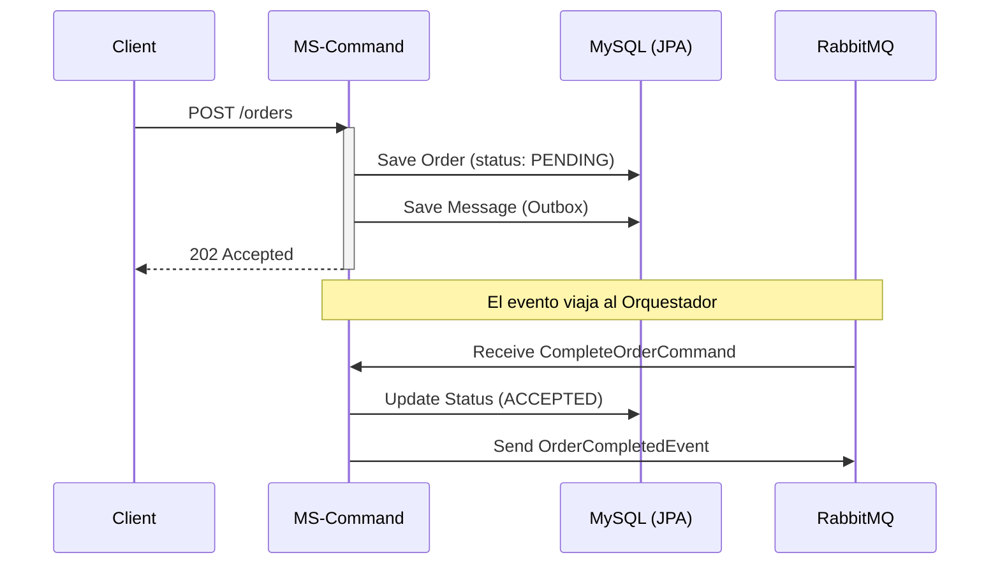

# MS Logistics Command (Escritura)

Este microservicio es responsable de la gestión de comandos en la arquitectura **CQRS** del sistema de logística. Maneja la persistencia transaccional de las órdenes y la generación de eventos de dominio iniciales.

## 🚀 Responsabilidades de Negocio
- Recepción de solicitudes de creación de órdenes vía REST.
- Validación inicial y persistencia en estado `PENDING`.
- Implementación de acciones de confirmación (`ACCEPTED`) o rechazo (`REJECTED`) dictadas por el orquestador SAGA.

## 🛠️ Stack Tecnológico
- **Java 21** & **Spring Boot 3.3.2**
- **Spring Data JPA** (Persistencia Relacional)
- **MySQL 9.3.0** (Base de Datos de Comandos)
- **RabbitMQ** (Broker de Mensajería)
- **Lombok** & **Jackson**

## 🏗️ Arquitectura y Patrones

### Pattern: Transactional Outbox (Simulado)
Para garantizar el **At-Least-Once Delivery**, el servicio utiliza un patrón de Outbox:
1. Dentro de la misma transacción de base de datos donde se guarda la `OrderEntity`, se registra un registro en `MessageEntity`.
2. Esto asegura que si la base de datos falla, el evento no se envía, manteniendo la consistencia atómica entre el estado del microservicio y el resto del sistema.

### Estructura de Capas:
- **`controller`**: Define el recurso `/orders` siguiendo principios RESTful.
- **`service`**: Capa de lógica de negocio donde reside la orquestación interna de la transacción (`@Transactional`).
- **`repository`**: Abstracción de acceso a datos utilizando el patrón Repository de Spring Data.
- **`listener`**: Punto de entrada para los comandos de compensación y finalización provenientes del orquestador.
- **`entity`**: Modelado de datos relacional.

## 🔄 Flujo de Datos

## ⚙️ Configuración Principal
- **Puerto**: `8081`
- **Base de Datos**: `db_orders`
- **Colas RabbitMQ**:
  - `order.complete.command`: Para recibir intrucciones de éxito.
  - `order.cancel.command`: Para recibir instrucciones de compensación.

---
*Galaxy Training - Advanced Software Engineering*
