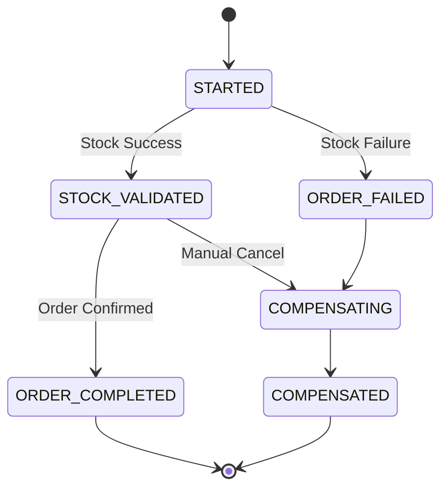

# MS Logistics Orchestrator (Cerebro del Sistema)

Este microservicio actúa como el **Orquestador Central** del sistema, encargado de gestionar la coherencia de las transacciones distribuidas mediante el patrón **Saga**.

## 🚀 Responsabilidades de Negocio
- Gestionar el ciclo de vida completo de una orden desde su creación hasta su finalización o compensación.
- Validar las transiciones de estado para evitar estados inconsistentes.
- Notificar cambios de estado críticos a los interesados (Clientes/Administradores) vía SMS y Email.

## 🛠️ Stack Tecnológico
- **Java 21** & **Spring Boot 3.3.2**
- **Spring Data JPA** (MySQL para persistencia de la SAGA)
- **Spring Application Events** (Comunicación interna desacoplada)
- **Spring Mail** (Integración con Gmail SMTP)
- **RabbitMQ** (Orquestación de Comandos y Eventos)

## 🏗️ Arquitectura y Patrones

### Pattern: Choreographed Saga with State Machine
El sistema utiliza una **Máquina de Estados (`SagaStateMachine`)** centralizada que garantiza que una saga solo pueda moverse entre estados permitidos:
- **`STARTED`**: Orden recibida, pendiente de validación.
- **`STOCK_VALIDATED`**: El inventario ha sido reservado con éxito.
- **`ORDER_COMPLETED`**: Flujo exitoso finalizado.
- **`ORDER_FAILED` / `COMPENSATING`**: Fallo detectado, iniciando reversión.
- **`COMPENSATED`**: Transacción revertida con éxito (Consistencia eventual).

### Pattern: Observer (Alertas Asíncronas)
Para no bloquear el flujo de la saga, las alertas (Email/SMS) se manejan mediante eventos de aplicación:
1. `SagaService` publica un `SagaStateChangedEvent`.
2. `SagaNotificationListener` captura el evento.
3. Se ejecutan las tareas de notificación de forma asíncrona (`@Async`).

## 🔄 Diagrama de Estados

## ⚙️ Configuración Principal
- **Puerto**: `8083`
- **Base de Datos**: `db_orchestrator`
- **Alertas**: Configurado para Gmail SMTP (App Password requerida).
- **Colas RabbitMQ**:
  - `order.created.queue`: Suscrito para iniciar nuevas sagas.
  - `stock.validated.queue` / `stock.failed.queue`: Feedback de inventario.
  - `order.completed.queue` / `order.cancelled.queue`: Feedback de confirmación final.

---
*Galaxy Training - Advanced Software Engineering*
