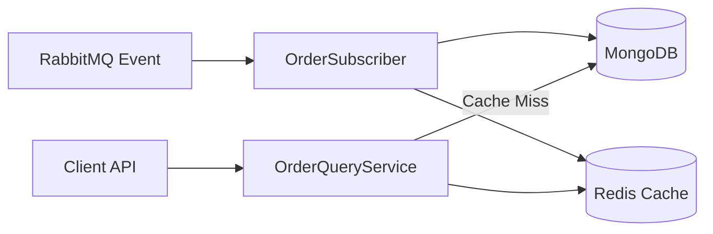

# MS Logistics Query (Lectura)

Este microservicio es responsable de la gestión de consultas en la arquitectura **CQRS** (Command Query Responsibility Segregation). Su objetivo principal es ofrecer una vista consolidada y de alto rendimiento de las órdenes.

## 🚀 Responsabilidades de Negocio
- Proporcionar una API de consulta rápida para el estado y detalles de las órdenes.
- Mantener un historial de estados actualizado de cada pedido.
- Sincronizar los datos de lectura a partir de los eventos generados por el lado de comandos.

## 🛠️ Stack Tecnológico
- **Java 21** & **Spring Boot 3.3.2**
- **Spring Data MongoDB** (Persistencia Documental)
- **Spring Data Redis** (Capa de Caché)
- **RabbitMQ** (Suscripción a Eventos)
- **MongoDB** (Read Model)
- **Redis** (High Speed Cache)

## 🏗️ Arquitectura y Patrones

### Pattern: CQRS Read Side (Proyecciones)
El microservicio consume eventos para construir **Proyecciones** (Read Models). A diferencia del lado de comandos, los datos aquí están desnormalizados y optimizados para la lectura:
1. Escucha eventos de la cola de RabbitMQ.
2. Actualiza el `OrderDocument` en MongoDB.
3. El documento incluye un historial embebido (`StatusHistory`) para evitar JOINs costosos.

### Pattern: Cache-Aside (Side Cache)
Para maximizar el rendimiento, se implementa una estrategia de caché:
- **Lectura**: Primero busca en Redis. Si no existe (Cache Miss), consulta MongoDB y actualiza la caché.
- **Escritura**: Al actualizar el modelo en MongoDB, también se refresca la entrada en Redis.

## 🔄 Flujo de Sincronización

## ⚙️ Configuración Principal
- **Puerto**: `8082`
- **Base de Datos**: `db_queries` (MongoDB)
- **Caché**: Redis (TTL configurable, por defecto 10 min)
- **Cola Suscrita**: `order.query.sync.queue` (vía Exchange de distribución)

---
*Galaxy Training - Advanced Software Engineering*
