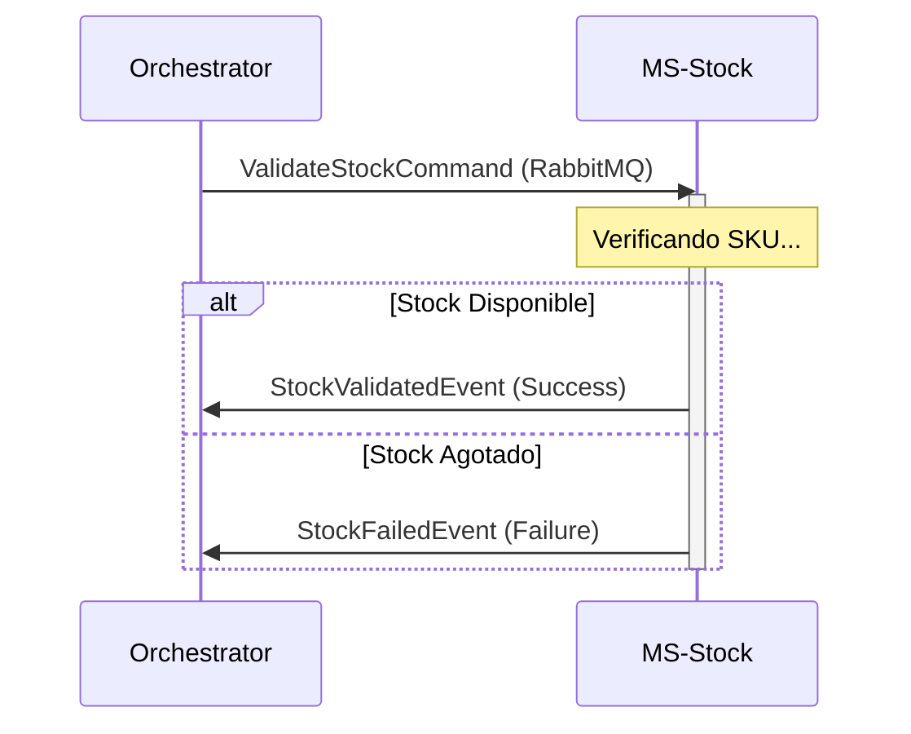

# MS Logistics Stock (Servicio de Inventario)

Este microservicio simula la gestión de stock y es una pieza clave en el flujo de validación de la **Saga**.

## 🚀 Responsabilidades de Negocio
- Validar la disponibilidad de productos para una orden específica.
- Reservar stock de manera temporal (Simulado).
- Notificar el éxito o fracaso de la validación al orquestador.

## 🛠️ Stack Tecnológico
- **Java 21** & **Spring Boot 3.3.2**
- **RabbitMQ** (Orquestación asíncrona)
- **Lombok** (Productividad)

## 🏗️ Arquitectura y Patrones

### Pattern: Simulated Domain Service
Para fines educativos y de demostración, este servicio actúa como un **Mock Inteligente**. No requiere base de datos persistente, ya que su objetivo es demostrar cómo el sistema reacciona ante diferentes respuestas de inventario:
1. Recibe un `ValidateStockCommand`.
2. Ejecuta una lógica de decisión (configurable para forzar éxitos o fallos).
3. Publica un evento de resultado inmediato.

### Estructura de Capas:
- **`listener`**: Contiene el `StockCommandListener`, que es el punto de entrada de los mensajes de RabbitMQ.
- **`application`**: Lógica de simulación de stock.

## 🔄 Flujo de Validación

## ⚙️ Configuración Principal
- **Puerto**: `8084`
- **Interacción RabbitMQ**:
  - `stock.validate.command`: Cola de entrada para recibir peticiones de validación.
  - `stock.validated.queue`: Cola de salida para notificar éxito.
  - `stock.failed.queue`: Cola de salida para notificar fallo.

---
*Galaxy Training - Advanced Software Engineering*
